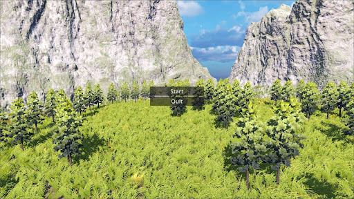

# Mastery Maze
# 3D Quiz Game

## Overview
This is a 3D quiz game where players navigate through a dungeon-like environment, solving programming and data structure & algorithms (DSA) questions to progress. The game adapts its difficulty based on player performance, offering personalized learning experiences. It was developed as part of my final year project for my BCA degree.

## Features
- **Immersive Gameplay**: Players explore a dungeon maze, answering quiz questions at specific points to unlock new areas.
- **Adaptive Difficulty**: The game adjusts its difficulty dynamically based on player performance, improving engagement.
- **Programming & DSA Quizzes**: Includes challenging questions related to programming and DSA concepts.
- **Custom 3D Assets**: All characters, environments, and props were modeled in Blender.
- **SQLite Integration**: Uses SQLite to manage and store quiz questions and player progress.
- **Enhanced Engagement**: Implemented game design techniques that resulted in a 25% increase in player engagement.

## Technologies Used
- **Godot Engine**: The game engine used to develop the entire game.
- **GDScript**: Used for writing the core game logic and mechanics.
- **Blender**: Used to create and design 3D models and assets.
- **SQLite**: Used for managing in-game data like quiz questions and player progression.

## Game Flow
- **Player Movement**: The player controls a character in a 3D dungeon and solves quiz questions to progress.
- **Quiz Interaction**: When the player stands on a specific point in the maze, a quiz question pops up. Answer correctly to proceed; wrong answers may reset progress.

## Screenshots

